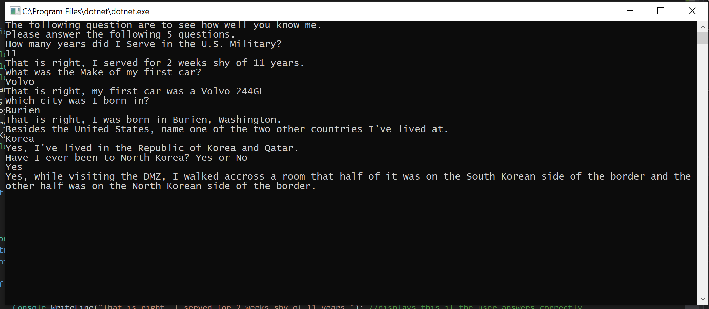
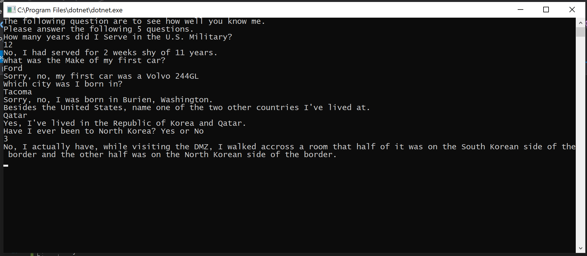
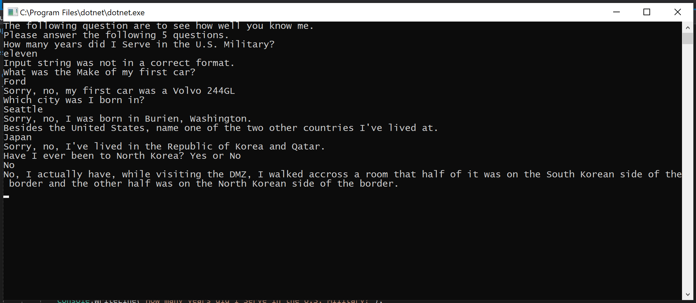

# Lab01: About Me Quiz

[](https://github.com/RichardLitt/standard-readme)

> This program askes 5 questions about me.

TODO: Fill out this long description.

## Table of Contents

- [Install](#install)
- [Usage](#usage)
- [Maintainers](#maintainers)
- [Contributing](#contributing)
- [License](#license)

## Install

```
```

## Lab Instructions

cf Lab 01: About Me Quiz
To Submit this Assignment
Create a new repo on your personal GitHub account
Name your repo Lab##-TITLE
Create a branch named NAME-LAB##
Write your code
Commit often
Push to your repository
Create a pull request from your branch back to master
Submit a link to your PR in canvas
In Canvas, Include the actual time it took you to complete the assignment as a comment (REQUIRED)
Include a README.md (contents described below)
Directions
Create an “About Me” quiz that has at least 5 different questions.
Each question should be something fun, unique, or interesting about yourself
Program Specifications
Your solution should include the following:
Main method
external methods- (at least 3 non-void return types)
Have different return types!
At least one try/catch/finally implementation
When running your application, it should activate the game without any direct code manipulation
Stay within scope of this project. Please only use concepts and resources that we have covered so far in previous labs/lectures/assigned prework. If you are unsure if it is within scope, please ask a TA or instructor.

Stretch
Track number of correct/incorrect questions - Show the user the number of correct/incorrect to user after quiz is over
README
Provide setup documentation

Comment your code.
Provide a readme that includes clear directions on setting up this program.
Questions to Consider:
What is the purpose of the program?
How do I run the program?
What does the program look like? (visual)

## Usage
After the initial greeting and instruction, the computer asks 5 questsions;

Argument 1

Type integer

Default: 'default value'

"How many years did I Serve in the U.S. Military?"

  if (years == 11)
  {
      Console.WriteLine("That is right, I served for 2 weeks shy of 11 years."); //displays this if the user answers correctly
  }
  else
  {
      Console.WriteLine("No, I had served for 2 weeks shy of 11 years."); //displays this if the user answers incorrectly
  }

Argument 2

Type string

Default: 'default value'

"What was the Make of my first car?"

  if (questTwo == "Volvo")
  {
      Console.WriteLine("That is right, my first car was a Volvo 244GL"); //displays this if the user answers correctly
      return questTwo;
  }
  else
  {
      Console.WriteLine("Sorry, no, my first car was a Volvo 244GL"); //displays this if the user answers incorrectly
      return questTwo;
  }

Argument 3

Type string

Default: 'default value'

"Which city was I born in?"

  if (city == "BURIEN")
  {
      Console.WriteLine("That is right, I was born in Burien, Washington."); //displays this if the user answers correctly
      return questThree;
  }
  else
  {
      Console.WriteLine("Sorry, no, I was born in Burien, Washington."); //displays this if the user answers incorrectly
      return questThree;
  }

Argument 4

Type string

Default: 'default value'

"Besides the United States, name one of the two other countries I've lived at."

  if (livedIn == "QATAR" || livedIn == "KOREA" || livedIn == "SOUTH KOREA" || livedIn == "REPUBLIC OF KOREA")
  {
      Console.WriteLine("Yes, I've lived in the Republic of Korea and Qatar."); //displays this if the user answers correctly
      return questFour;
  }
  else
  {
      Console.WriteLine("Sorry, no, I've lived in the Republic of Korea and Qatar."); //displays this if the user answers incorrectly
      return questFour;
  }

Argument 5

Type string

Default: 'default value'

"Have I ever been to North Korea? Yes or No"

  if (visited == "Y" || visited == "YES")
  {
      Console.WriteLine("Yes, while visiting the DMZ, I walked accross a room that half of it was on the South Korean side of the border and the other half was on the North Korean side of the border."); //displays this if the user answers correctly
      return visited;

  }
  else
  {
      Console.WriteLine("No, I actually have, while visiting the DMZ, I walked accross a room that half of it was on the South Korean side of the border and the other half was on the North Korean side of the border."); //displays this if the user answers correctly
      return visited;
  }

Exception Handler

  try
  {
    //tested code here
  }
  catch (Exception result)
  {
      Console.WriteLine(result.Message);
  }

  This code is what I used to track any errors in my program


Example of all the questions answered correctly


Example of all the questions answered wrong


Example of the Exception handler being triggered on the first question


## Maintainers

[@Michael-S-Kelly](https://github.com/Michael-S-Kelly)

## Contributing


Small note: If editing the README, please conform to the [standard-readme](https://github.com/RichardLitt/standard-readme) specification.

## License

MIT © 2019 Michael Kelly
